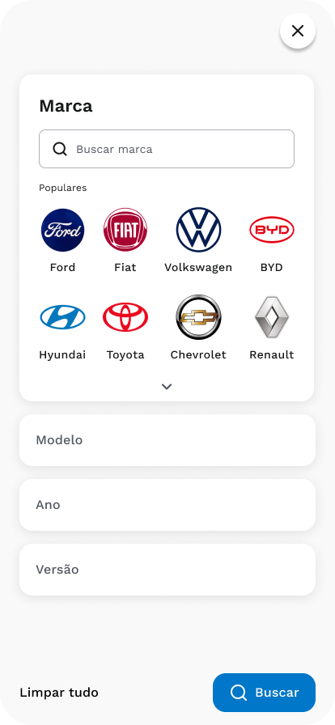
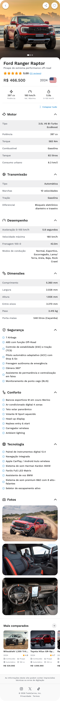
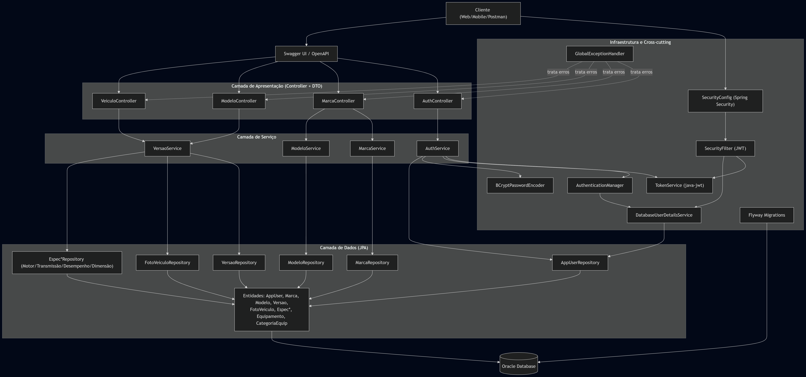

# 🚗 BlindSpot API

API RESTful desenvolvida para o Challenge de **Arquitetura Orientada a Serviços (SOA)**, com foco em consulta de dados técnicos de veículos, autenticação JWT e organização em camadas.

<details open>
  <summary><h3><strong>📑 Sumário</strong></h3></summary>
  <ol>
    <li><a href="#info">Informações</a></li>
    <li><a href="#equipe">Equipe</a></li>
    <li><a href="#visao-geral">Visão Geral</a></li>
    <li><a href="#tecnologias">Tecnologias e Componentes</a></li>
    <li><a href="#como-executar">Como Executar</a></li>
    <li><a href="#fluxo-uso-api">Fluxo de Uso da API</a></li>
    <li><a href="#endpoints">Endpoints Principais</a></li>
    <li><a href="#arquitetura">Arquitetura (Camadas)</a></li>
    <li><a href="#estrutura-do-projeto">Estrutura do Projeto</a></li>
    <li><a href="#seguranca">Segurança</a></li>
    <li><a href="#banco-de-dados-e-migracoes">Banco de Dados e Migrações</a></li>
  </ol>
</details>

<h2 id="info">ℹ️ Informações</h2>

| Campo | Valor |
|---|---|
| **Projeto** | BlindSpot API |
| **Curso** | Engenharia de Software |
| **Disciplina** | Arquitetura Orientada a Serviços (SOA) |
| **Professor(a)** | SALATIEL LUZ MARINHO |
| **Turma** | 3ESPX |
| **Instituição** | FIAP |

<h2 id="equipe">👥 Equipe</h2>

| Integrante | RM |
|---|---|
| Augusto Barcelos Barros | 565065 |
| Caio Felipe de Lima Bezerra | 556197 |
| Juan Francisco Alves Muradas | 555541 |
| Lucas Derenze Simidu | 555931 |
| Sofia Fernandes | 554873 |

<h2 id="visao-geral">📋 Visão Geral</h2>

Este projeto implementa uma API para:

- autenticação de usuários com **JWT**;
- consulta de **marcas**, **modelos** e **versões** de veículos;
- consulta de **detalhes técnicos** (motor, transmissão, desempenho, dimensões, fotos e equipamentos);
- documentação automática via **Swagger/OpenAPI**;
- persistência em **Oracle** com controle de versão do banco usando **Flyway**.

A solução segue separação clara entre camadas de **apresentação**, **serviço** e **dados**, alinhada aos critérios de avaliação SOA.

<h2 id="tecnologias">🧰 Tecnologias e Componentes</h2>

- **Java 21**
- **Spring Boot 4**
- **Spring Web MVC**
- **Spring Security**
- **Spring Data JPA**
- **Flyway**
- **Oracle Database (ojdbc11)**
- **JWT (java-jwt)**
- **Swagger/OpenAPI (springdoc)**
- **Maven**

<h2 id="como-executar">🚀 Como Executar</h2>

### Pré-requisitos

- Java 21+
- Maven (ou uso do wrapper `mvnw`)
- Oracle Database acessível

### 1. Clone o repositório

```bash
git clone https://github.com/Asteriuz/Challenge-SOA.git
cd Challenge-SOA
```

### 2. Configure as variáveis de ambiente

```bash
DB_URL=jdbc:oracle:thin:@//HOST:PORT/SERVICE_NAME
DB_USER=seu_usuario
DB_PASSWORD=sua_senha
JWT_SECRET=seu_segredo_jwt
```

### 3. Execute a aplicação

```bash
./mvnw spring-boot:run
```

No Windows (PowerShell):

```powershell
.\mvnw.cmd spring-boot:run
```

### 4. Acesse

- API: `http://localhost:8080`
- Swagger UI: `http://localhost:8080/swagger-ui`

<h2 id="fluxo-uso-api">🎯 Fluxo de Uso da API</h2>

A BlindSpot API foi desenvolvida para fornecer uma experiência completa na busca e consulta de informações técnicas de veículos. Confira abaixo como a API é utilizada através da interface do usuário:

<details>
  <summary><strong>📱 Passo 1: Busca e Filtragem de Veículos</strong></summary>

  <div align="center">
    
  </div>

  Na primeira etapa, o usuário realiza uma busca filtrada por:
  - **Marca** (com opções populares: Ford, Fiat, Volkswagen, BYD, Hyundai, Toyota, Chevrolet, Renault)
  - **Modelo** (obtido através de `GET /api/marcas/{marcaId}/modelos`)
  - **Ano** (obtido através de `GET /api/modelos/{modeloId}/anos`)
  - **Versão** (obtido através de `GET /api/modelos/{modeloId}/versoes`)

  **Endpoints utilizados:**
  - `GET /api/marcas?populares=true` - Obter marcas populares
  - `GET /api/marcas/{marcaId}/modelos` - Listar modelos por marca
  - `GET /api/modelos/{modeloId}/anos` - Listar anos disponíveis
  - `GET /api/veiculos/busca?marca=X&modelo=Y&ano=Z&versao=W` - Buscar versões com filtros

</details>

<details>
  <summary><strong>🚗 Passo 2: Visualização de Detalhes Técnicos</strong></summary>

  <div align="center">
    
  </div>

  Após selecionar um veículo, o usuário acessa informações detalhadas:
  - **Informações Básicas** (Marca, Modelo, Ano, Preço)
  - **Motor** (Cilindradas, Potência, Combustível)
  - **Transmissão** (Tipo, Quantidade de marchas)
  - **Desempenho** (Aceleração, Velocidade máxima, Consumo)
  - **Dimensões** (Comprimento, Largura, Altura, Peso)
  - **Segurança** (Airbags, Controle de tração, Sistemas assistivos)
  - **Conforto** (Ar-condicionado, Volante multifuncional, Banco aquecido)
  - **Tecnologia** (Painel digital, Câmera 360°, Sistema de som premium)
  - **Fotos e Galeria** (Exterior, Interior, Detalhes específicos)
  - **Sugestões de Comparação** (Veículos similares mais comparados)

  **Endpoint principal:**
  - `GET /api/veiculos/{idVersao}` - Obter detalhes completos do veículo
  - `GET /api/veiculos/{idVersao}/mais-comparados` - Obter sugestões para comparação

</details>

<hr/>

**💡 Fluxo Completo:**
```
1. Usuário faz login (POST /api/auth/login) → Recebe JWT Token
   ↓
2. Busca marcas populares (GET /api/marcas?populares=true)
   ↓
3. Seleciona marca e busca modelos (GET /api/marcas/{marcaId}/modelos)
   ↓
4. Seleciona modelo e lista anos (GET /api/modelos/{modeloId}/anos)
   ↓
5. Seleciona ano e lista versões (GET /api/modelos/{modeloId}/versoes)
   ↓
6. Realiza busca com filtros (GET /api/veiculos/busca?...)
   ↓
7. Clica em um veículo para ver detalhes (GET /api/veiculos/{idVersao})
   ↓
8. Visualiza sugestões de comparação (GET /api/veiculos/{idVersao}/mais-comparados)
```

<h2 id="endpoints">🌐 Endpoints Principais</h2>

| Método | Endpoint | Descrição | Autenticação |
|---|---|---|---|
| `POST` | `/api/auth/login` | Login e geração do token JWT | Não |
| `POST` | `/api/auth/cadastro` | Cadastro de novo usuário | Não |
| `GET` | `/api/marcas` | Lista marcas (com filtro `populares`) | Sim |
| `GET` | `/api/marcas/{marcaId}/modelos` | Lista modelos de uma marca | Sim |
| `GET` | `/api/modelos/{modeloId}/anos` | Lista anos de um modelo | Sim |
| `GET` | `/api/modelos/{modeloId}/versoes` | Lista versões por modelo/ano | Sim |
| `GET` | `/api/veiculos/busca` | Busca de versões por filtros | Sim |
| `GET` | `/api/veiculos/{idVersao}` | Detalhes completos de uma versão | Sim |
| `GET` | `/api/veiculos/{idVersao}/mais-comparados` | Sugestões de versões para comparação | Sim |

> Documentação interativa: **`/swagger-ui`**  
> Ex.: `http://localhost:8080/swagger-ui`

<h2 id="arquitetura">🏗️ Arquitetura (Camadas)</h2>



<h2 id="estrutura-do-projeto">📁 Estrutura do Projeto</h2>

```text
Challenge-SOA/
├── pom.xml
├── README.md
├── src/
│   ├── main/
│   │   ├── java/br/com/blindspot/
│   │   │   ├── BlindSpotApplication.java
│   │   │   └── api/
│   │   │       ├── config/        # Segurança e OpenAPI
│   │   │       ├── controller/    # Endpoints REST
│   │   │       ├── dto/           # Request/Response DTOs
│   │   │       ├── domain/        # Entidades JPA
│   │   │       ├── exception/     # Tratamento global de exceções
│   │   │       ├── repository/    # Acesso a dados (Spring Data JPA)
│   │   │       ├── security/      # JWT e autenticação
│   │   │       └── service/       # Regras de negócio
│   │   └── resources/
│   │       ├── application.properties
│   │       ├── application-dev.properties
│   │       └── db/
│   │           ├── migration/     # Flyway V1, V2...
│   │           └── testdata/      # Carga mock
│   └── test/java/br/com/blindspot/
│       └── BlindSpotApplicationTests.java
└── target/
```

<h2 id="seguranca">🔐 Segurança</h2>

- Autenticação com **JWT Bearer Token**.
- Endpoints públicos:
  - `POST /api/auth/login`
  - `POST /api/auth/cadastro`
  - `/v3/api-docs/**`, `/swagger-ui/**`
- Demais endpoints exigem token válido no header:

```http
Authorization: Bearer <seu_token>
```

<h2 id="banco-de-dados-e-migracoes">🗄️ Banco de Dados e Migrações</h2>

Migrações versionadas com Flyway:

- `V1__create_users.sql` → estrutura de usuários
- `V2__create_vehicles.sql` → estrutura de veículos
- `V999__insert_dados_mock.sql` → dados de apoio/teste

Configuração principal em `src/main/resources/application-dev.properties`.
